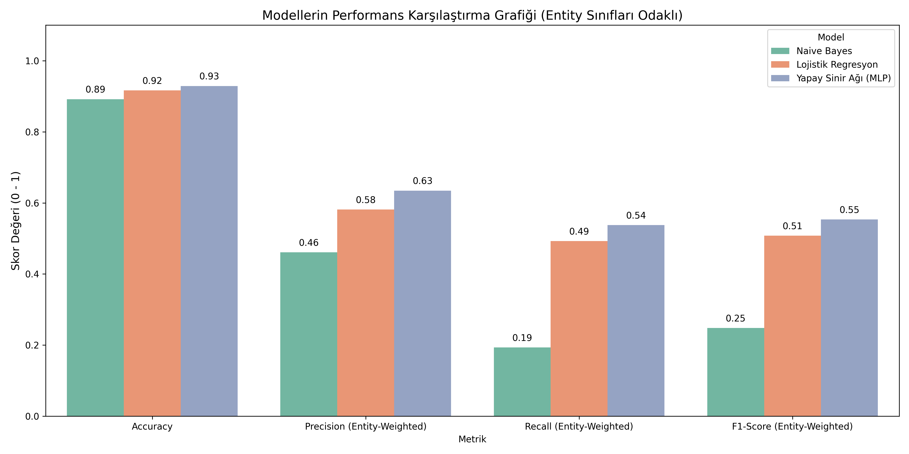
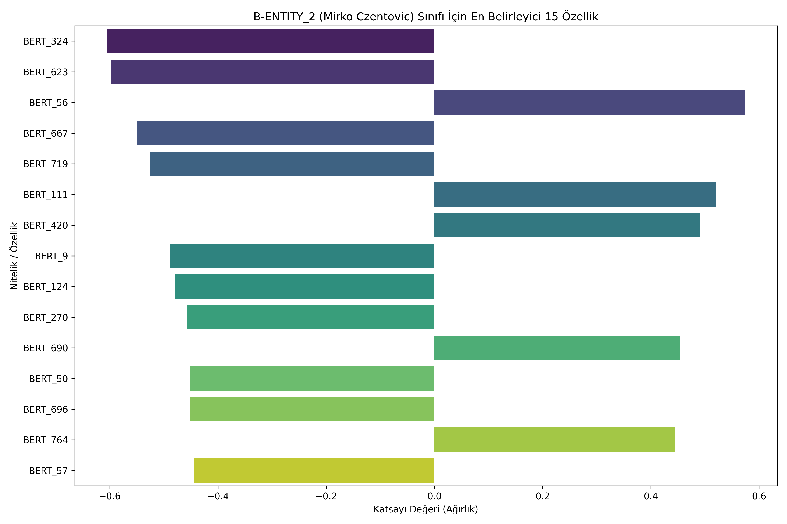
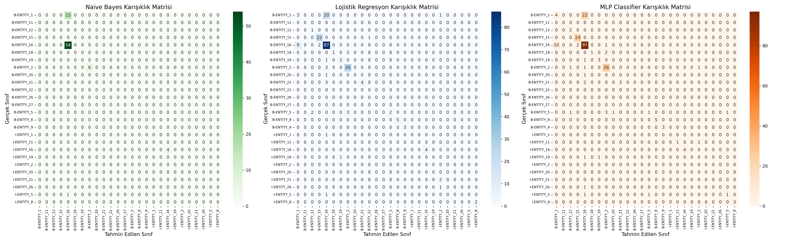

# Turkish Coreference Resolution with BERTurk


Türkçe metinlerdeki varlık ve zamir ilişkilerini belirlemeye yönelik deneysel bir doğal dil işleme çalışması. Projede elle etiketlenmiş CoNLL verisi, dilsel özellikler ve BERTurk bağlamsal gösterimleri bir araya getirilerek üç farklı sınıflandırma yaklaşımı karşılaştırılmıştır.

> Bu çalışma, eşgönderim çözümleme problemini token düzeyinde bir sıralı etiketleme yaklaşımıyla ele alan akademik bir dönem projesidir.

## Projenin Amacı

Bir metindeki kişi adları, zamirler ve aynı varlığa gönderimde bulunan ifadeler arasındaki ilişkiyi otomatik olarak tespit etmek hedeflenmiştir. Örneğin aşağıdaki cümlede `Mirko Czentovic` ile `o` ifadesinin aynı varlığa gönderimde bulunup bulunmadığı araştırılır:

> Mirko Czentovic çok iyi bir satranç oyuncusuydu ve o, rahip tarafından korunuyordu.

Bu amaçla problem, IOB2 benzeri etiketler kullanan çok sınıflı token sınıflandırma görevi olarak modellenmiştir.

## Öne Çıkanlar

- 563 cümle ve 13.461 token içeren, elle etiketlenmiş Türkçe veri kümesi
- Kelime biçimi, önek, sonek, büyük harf ve zamir bilgisi gibi dilsel özellikler
- `dbmdz/bert-base-turkish-cased` modeliyle 768 boyutlu bağlamsal kelime gösterimleri
- Multinomial Naive Bayes, Lojistik Regresyon ve MLP karşılaştırması
- Tekrarlanabilir eğitim/test ayrımı için sabit rastgelelik tohumu (`42`)
- Model karşılaştırma grafikleri, karışıklık matrisleri ve özellik önem analizi

## Yaklaşım

Proje hattı dört temel aşamadan oluşur:

1. CoNLL biçimindeki veri cümlelere ve tokenlara ayrılır.
2. Her token için biçimsel ve bağlamsal özellikler çıkarılır.
3. BERTurk alt-token gösterimleri ortalama havuzlama ile tek bir kelime vektörüne dönüştürülür.
4. Geleneksel özellikler ve BERT vektörleri birleştirilerek sınıflandırma modelleri eğitilir.

Naive Bayes yalnızca geleneksel özelliklerle temel model olarak kullanılmıştır. Lojistik Regresyon ve MLP ise geleneksel özelliklerle BERTurk gösterimlerinin birleşimi üzerinde eğitilmiştir.

## Sonuçlar

| Model | Accuracy | Precision | Recall | F1-score |
|---|---:|---:|---:|---:|
| Multinomial Naive Bayes | 89.18% | 46.09% | 19.33% | 24.82% |
| Lojistik Regresyon | 91.65% | 58.14% | 49.24% | 50.78% |
| **MLP** | **92.89%** | **63.46%** | **53.77%** | **55.34%** |

Precision, recall ve F1-score değerleri baskın `O` sınıfı dışarıda bırakılarak, varlık sınıfları üzerinde ağırlıklı ortalama ile hesaplanmıştır. Accuracy tüm tokenları içerir. Bu nedenle model karşılaştırmasında yalnızca accuracy değerine değil, varlık odaklı F1-score değerine de bakılmalıdır.



MLP, varlık odaklı F1-score açısından temel Naive Bayes modelinin iki katından fazla performans göstermiştir. Bu sonuç, BERTurk bağlamsal gösterimlerinin geleneksel dilsel özelliklere eklenmesinin yararlı olduğunu göstermektedir.

## Görsel Analizler

### Özellik Önem Dereceleri

Lojistik Regresyon katsayıları incelenerek belirli bir varlık sınıfının tahmininde en etkili özellikler görselleştirilmiştir.



### Karışıklık Matrisleri

Modellerin varlık sınıflarındaki doğru tahminleri ve sınıflar arası karışmaları karşılaştırılmıştır.



## Kurulum

Projeyi yerel ortamda çalıştırmak için Python 3.10 veya daha güncel bir sürüm önerilir. Depoyu klonladıktan sonra proje dizininde bir sanal ortam oluşturun:

```bash
python -m venv .venv
```

Sanal ortamı etkinleştirin:

```bash
# Windows
.venv\Scripts\activate

# macOS / Linux
source .venv/bin/activate
```

Gerekli paketleri yükleyin:

```bash
pip install numpy pandas scipy scikit-learn torch transformers matplotlib seaborn jupyter
```

Notebook'u başlatın:

```bash
jupyter notebook Coreference_Resolution.ipynb
```

İlk çalıştırmada BERTurk model dosyaları Hugging Face üzerinden indirileceği için internet bağlantısı gerekir. CUDA destekli bir ekran kartı işlemi hızlandırır; kod, CUDA bulunmadığında otomatik olarak CPU kullanır.

## Veri Biçimi

`veri.conll` dosyasında her satır bir token ve etiket içerir. Boş satırlar cümle sınırlarını belirtir.

```text
Mirko       B-ENTITY_2
Czentovic   I-ENTITY_2
geldi       0
.           0
```

- `0`: Herhangi bir hedef varlığa ait olmayan token
- `B-ENTITY_X`: Bir varlık ifadesinin başlangıcı
- `I-ENTITY_X`: Aynı varlık ifadesinin devamı

## Proje Yapısı

```text
.
|-- Coreference_Resolution.ipynb     # Veri işleme, eğitim ve değerlendirme
|-- veri.conll                       # Etiketlenmiş veri kümesi
|-- NLP_Proje_Rapor_21360859056.pdf  # Ayrıntılı proje raporu
|-- model_comparison.png             # Model performans grafiği
|-- confusion_matrices.png           # Karışıklık matrisleri
|-- feature_importance.png           # Özellik önem grafiği
`-- README.md
```

## Sınırlılıklar

- Veri kümesi tek bir edebi kaynaktan üretildiği için farklı alanlara genelleme sınırlıdır.
- Modeller tokenları bağımsız olarak sınıflandırır; IOB2 geçişleri model tarafından yapısal olarak zorlanmaz.
- Sistem, standart uçtan uca eşgönderim çözümlemedeki mention detection ve mention-pair linking aşamalarını ayrı olarak modellemez.
- BERTurk ağırlıkları yeniden eğitilmemiş, model yalnızca bağlamsal özellik çıkarıcı olarak kullanılmıştır.
- Veri kümesindeki bazı varlık sınıfları için örnek sayısı düşüktür.

Bu sınırlılıklar nedeniyle sonuçlar, genel amaçlı bir Türkçe coreference çözümleyicisinin performansı olarak değil, kontrollü bir veri kümesi üzerindeki deneysel model karşılaştırması olarak değerlendirilmelidir.

## Gelecek Çalışmalar

- CRF katmanı veya geçiş kurallarıyla geçerli IOB2 dizileri üretmek
- Veri kümesini farklı metin türleri ve daha fazla varlıkla genişletmek
- BERTurk modelini görev üzerinde fine-tune etmek
- Mention-pair veya span tabanlı gerçek bir coreference mimarisi geliştirmek
- Sınıf dengesizliği için örnekleme ve ağırlıklandırma yöntemlerini karşılaştırmak
- CoNLL coreference metrikleriyle daha kapsamlı değerlendirme yapmak

## Etik ve Veri Kullanımı

Veri kümesi edebi bir metinden türetilmiştir. Projeyi veya veri kümesini yeniden kullanmadan önce kaynak metnin ve kullanılan Türkçe çevirinin yayın/lisans koşullarını kontrol edin. Raporda bulunan yazar ve öğrenci bilgileri, depo herkese açılmadan önce yayın tercihinize göre gözden geçirilmelidir.

## Rapor

Deney düzeni, özellik mühendisliği, model sonuçları ve ayrıntılı yorumlar için [proje raporunu](NLP_Proje_Rapor_21360859056.pdf) inceleyebilirsiniz.

---

Bu proje, Türkçe doğal dil işleme alanında özellik mühendisliği ile bağlamsal dil modeli gösterimlerini birlikte kullanmanın etkisini araştırmak amacıyla hazırlanmıştır.
